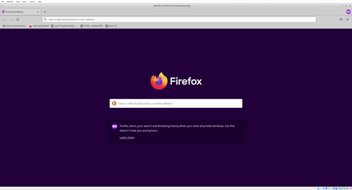

# Frontend Mentor - Product Preview Card solution

This is a solution to the [Product preview card component challenge on Frontend Mentor](https://www.frontendmentor.io/challenges/product-preview-card-component-GO7UmttRfa).

## Table of contents

- [Frontend Mentor - Product Preview Card solution](#frontend-mentor---product-preview-card-solution)
  - [Table of contents](#table-of-contents)
  - [Overview](#overview)
    - [The challenge](#the-challenge)
    - [Screenshots](#screenshots)
    - [Links](#links)
  - [My process](#my-process)
    - [Built with](#built-with)
    - [What I learned](#what-i-learned)
    - [Continued development](#continued-development)
    - [Useful resources](#useful-resources)
  - [Author](#author)

## Overview

### The challenge

Users should be able to:

- View the optimal layout depending on their device's screen size
- See hover and focus states for interactive elements

### Screenshots

### Links

- Solution URL: [Add solution URL here](https://your-solution-url.com)
- Live Site URL: [Add live site URL here](https://your-live-site-url.com)

## My process

### Built with

- Semantic HTML5 markup
- CSS custom properties
- [React](https://reactjs.org/) - JS library
- [Next.js](https://nextjs.org/) - React framework
- [SASS](https://sass-lang.com/) - For styles
- [Jest](https://jestjs.io/) - For testing

### What I learned

- How to write extensible media quieries using mixins and Sass variables
- Sass will be deprecating @import. Recommended to utilize @use instead
- How to leverage responsive units
- Planning and implementing layouts using Flexbox
- Why margin collapse happens and how to resolve it
- Using assertions from the Jest-Dom library

Overall this project was a great opportunity to practice building a design handed off to me with a set of specific style guidelines. Given the simplistic nature of the project, I was also able to successfully practice an approach using test driven development.

### Continued development

In future projects I would like to continue practicing the following:

- Using responsive units
- Meeting WCAG AA accessibility standards
- Writing media queries with Scss
- Building layouts using Flexbox
- Unit testing with Jest
- Developing with a mobile first approach

Additionally, I'd like to return to this project and implement the following:

- TypeScript
- Styled Components

### Useful resources

- [Test-Driven Development for Building User Interfaces](https://blog.testproject.io/2021/03/23/test-driven-development-for-building-user-interfaces/) - This helped me understand the workflow behind test driven development in a frontend context. With a better understanding, and experience now as well, I feel much more confident and willing to build using TDD.
- [Introducing Sass Modules](https://www.example.com) - This article was great for helping me understand Sass modules better, and particularly how @use works. I'd recommend it to anyone that needs help understanding the nuances of namespacing.

## Author

- GitHub - [@Gomurmamma](https://www.your-site.com)
- Instagram - [@Gomurmamma](https://www.instagram.com/Gomurmamma)
